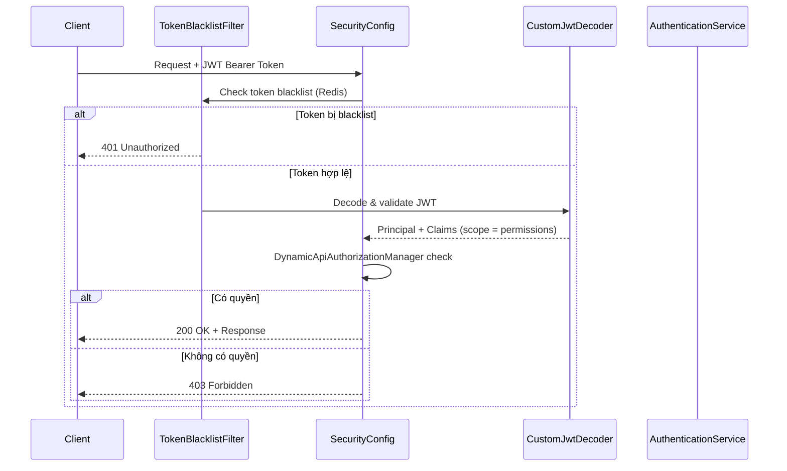
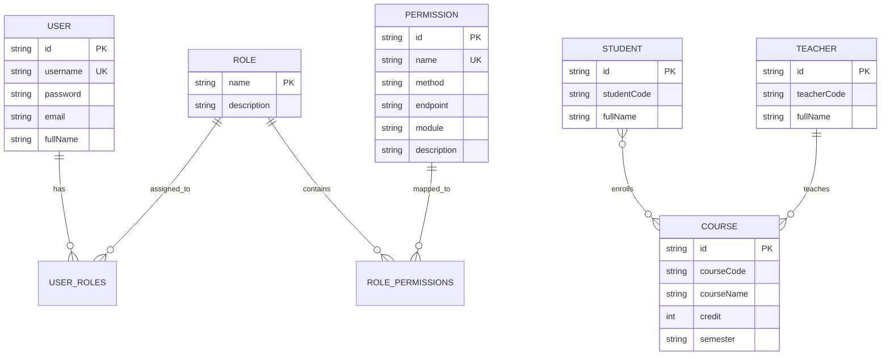
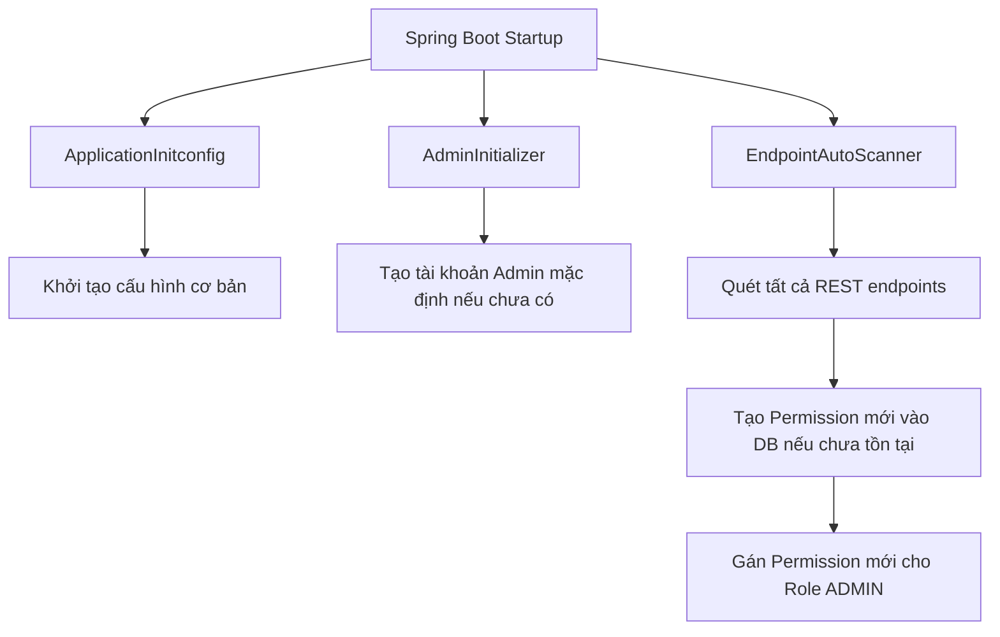

# ARCHITECTURE.md — Kiến trúc hệ thống University Management

> **Loại**: Tài liệu sống — cập nhật tại chỗ khi kiến trúc thay đổi.

---

## 1. Tổng quan kiến trúc

Hệ thống theo mô hình **Layered Architecture** (3 tầng) chuẩn Spring Boot:

```
┌─────────────────────────────────────────────────┐
│                  CLIENT (Frontend)               │
│           React / Vue (port 3000/5173)           │
└──────────────────────┬──────────────────────────┘
                       │ HTTP + JWT Bearer Token
┌──────────────────────▼──────────────────────────┐
│              CONTROLLER LAYER                    │
│  AuthenticationController, StudentController,    │
│  TeacherController, CourseController,            │
│  UserController, RoleController,                 │
│  PermissionController                            │
│  ─── Request Validation (DTO) ───                │
└──────────────────────┬──────────────────────────┘
                       │
┌──────────────────────▼──────────────────────────┐
│               SERVICE LAYER                      │
│  Interfaces: *Service.java                       │
│  Implementations: implement/*ServiceImpl.java    │
│  ─── Business Logic + MapStruct Mapping ───      │
└──────────────────────┬──────────────────────────┘
                       │
┌──────────────────────▼──────────────────────────┐
│             REPOSITORY LAYER                     │
│  Spring Data JPA repositories                    │
│  Custom: CourseRepositoryCustom + Impl           │
└──────────────────────┬──────────────────────────┘
                       │
┌──────────────────────▼──────────────────────────┐
│              DATA STORES                         │
│  MySQL (entities) ──── Redis (token blacklist)   │
└─────────────────────────────────────────────────┘
```

## 2. Security Architecture

### 2.1. Luồng xác thực (Authentication Flow)



### 2.2. Phân quyền động (Dynamic API-Based PBAC)

Chi tiết: [`docs/architecture/security-api-permission-design.md`](architecture/security-api-permission-design.md) `current`

- **EndpointAutoScanner**: Tự động quét tất cả `@RestController` khi khởi chạy → tạo `Permission` mới vào DB.
- **DynamicApiAuthorizationManager**: So khớp `HTTP Method + Path` của request với permissions trong JWT token.
- **Permission naming**: `METHOD_PATH` (ví dụ: `GET_/students`, `POST_/courses`).

### 2.3. JWT Token

- **Valid duration**: 1 giờ
- **Refreshable duration**: 100 giờ
- **Logout**: Token bị thêm vào blacklist trong Redis (`InvalidatedToken` entity).
- **Scope claim**: Chứa tập hợp tất cả permissions từ các roles của user.

## 3. Data Layer

### 3.1. Entity Relationship Diagram



### 3.2. Caching Strategy

- **Redis** được dùng cho:
  - Token blacklist (logout invalidation)
  - Có thể mở rộng cho session cache, API rate limiting

### 3.3. Custom Repository

- `CourseRepositoryCustom` + `CourseRepositoryImpl`: Logic truy vấn tùy chỉnh cho Course (ngoài CRUD chuẩn).

## 4. Cross-cutting Concerns

### 4.1. Exception Handling

```
GlobalExceptionHandler (@RestControllerAdvice)
├── AppException        → ErrorCode enum → ApiResponse (HTTP status tùy ErrorCode)
├── MethodArgumentNotValidException → Validation errors
└── Exception           → Generic 500 error
```

- Tất cả lỗi trả về dạng `ApiResponse` envelope thống nhất.

### 4.2. DTO Mapping

- **MapStruct** cho chuyển đổi Entity ↔ DTO.
- Mapper interfaces nằm trong `mapper/` package.
- Lombok `@Builder` / `@Data` trên DTOs.

### 4.3. Reports

- **JasperReports** tích hợp cho xuất báo cáo.
- Templates nằm trong `src/main/resources/reports/`.
- Mock data trong `reportmock/` package.

### 4.4. CORS

- Cho phép origins: `localhost:3000`, `localhost:5173`, `localhost:4173` (React/Vue dev servers).

## 5. Initialization Flow



## 6. Deployment

- **Dev**: `./mvnw spring-boot:run` với MySQL + Redis chạy local.
- **Test**: H2 in-memory database, Testcontainers cho integration tests.
- **Prod**: Chưa có cấu hình CI/CD hoặc Dockerfile (cần bổ sung).

---

## Chưa khớp thực tế

| Claim | Ý định | Trạng thái | Bằng chứng |
| ----- | ------ | ---------- | ----------- |
| (rỗng — cập nhật khi phát hiện sai lệch) | | | |
