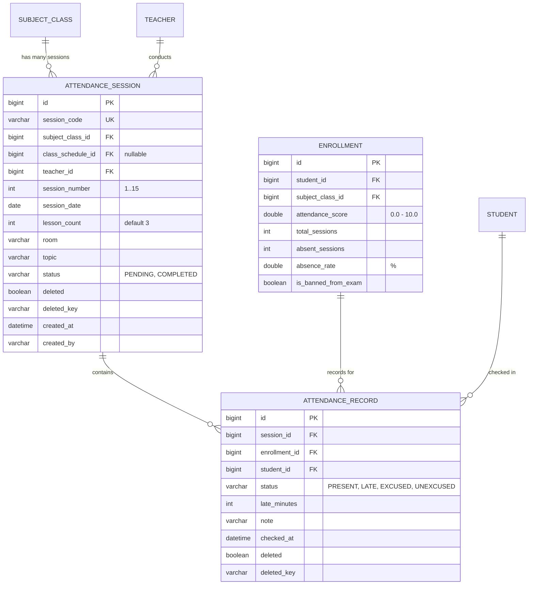
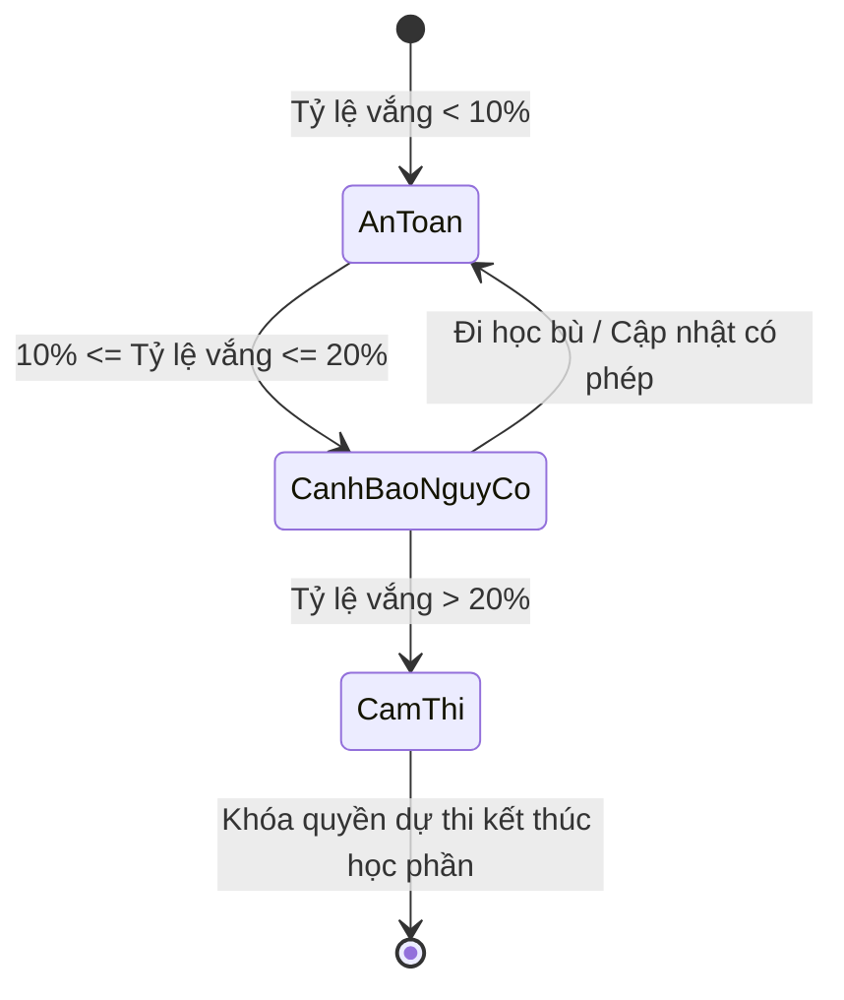
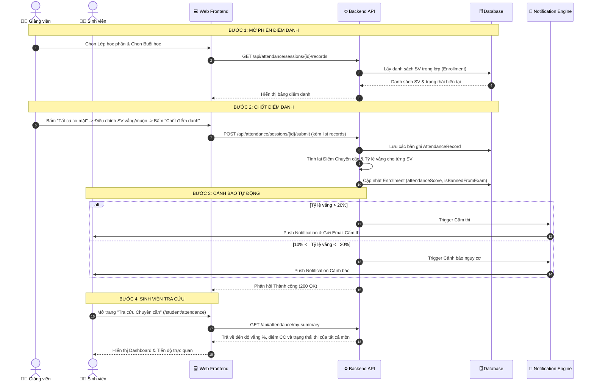

# Tài Liệu Đặc Tả Nghiệp Vụ: Phân Hệ Điểm Danh & Cảnh Báo Chuyên Cần
*(Attendance & Absence Warning Module Specification)*

*Dự án:* **University Management System**  
*Thư mục lưu trữ:* `university-management/docs/ATTENDANCE_MODULE_SPEC.md`  
*Tài liệu dành cho:* Phát triển, Vận hành, Kiểm thử và Mở rộng hệ thống  
*Ngày tạo:* 27/08/2026  
*Trạng thái:* Sẵn sàng triển khai (Approved for Implementation)  

---

## 1. Tổng Quan Phân Hệ (Module Overview)

Phân hệ **Điểm danh & Cảnh báo Chuyên cần** là một mắt xích trọng yếu trong vòng đời quản lý đào tạo tín chỉ đại học, nằm giữa khâu **Xếp lịch / Ghi danh môn học** và khâu **Nhập điểm / Xét điều kiện dự thi**.

### Mục tiêu chính:
1. **Đối với Giảng viên:** Cung cấp công cụ điểm danh lớp học phần trực quan, thao tác nhanh (1-click), hỗ trợ điểm danh theo buổi học định kỳ hoặc buổi học bù.
2. **Đối với Sinh viên:** Tra cứu minh bạch nhật ký điểm danh từng buổi, theo dõi tỷ lệ chuyên cần thời gian thực và nhận cảnh báo sớm trước nguy cơ bị cấm thi.
3. **Đối với Phòng Đào tạo / Admin:** Tự động hóa việc tính điểm chuyên cần (thang điểm 10), áp dụng chế tài cấm thi khi vắng quá $20\%$ số tiết học theo Quy chế Đào tạo, kết xuất danh sách cấm thi nộp Hội đồng thi.

---

## 2. Thuật Ngữ & Khái Niệm Nghiệp Vụ (Ubiquitous Language)

| Thuật ngữ | Tiếng Anh | Định nghĩa & Ý nghĩa nghiệp vụ |
| :--- | :--- | :--- |
| **Buổi học / Phiên điểm danh** | `Attendance Session` | Một buổi học thực tế diễn ra trong ngày của một Lớp học phần (thường kéo dài 2 - 4 tiết). |
| **Bản ghi điểm danh** | `Attendance Record` | Trạng thái tham gia của một sinh viên cụ thể trong một buổi học. |
| **Có mặt** | `PRESENT` | Sinh viên tham dự đầy đủ buổi học. |
| **Đi muộn** | `LATE` | Sinh viên đến lớp muộn (ví dụ sau 15 phút), được tính giảm trừ điểm chuyên cần. |
| **Vắng có phép** | `EXCUSED_ABSENCE` | Sinh viên có đơn xin phép hợp lệ (ốm đau, việc gia đình có giấy tờ). |
| **Vắng không phép** | `UNEXCUSED_ABSENCE`| Sinh viên tự ý bỏ tiết không có lý do chính đáng. |
| **Tỷ lệ vắng học** | `Absence Rate (%)` | Tỷ lệ phần trăm số buổi/tiết sinh viên vắng so với tổng số buổi/tiết của học phần. |
| **Cấm thi kết thúc học phần** | `Exam Ban` | Chế tài khi sinh viên vắng vượt quá ngưỡng cho phép ($> 20\%$), bị khóa quyền dự thi cuối kỳ và nhận điểm 0 thi. |

---

## 3. Mô Hình Thực Thể & Cơ Sở Dữ Liệu (Data Model & Schema)



### 3.1. Entity `AttendanceSession`
* **Bảng:** `attendance_session`
* **Kế thừa:** `BaseEntity` (tự động có `id`, `createdAt`, `createdBy`, `updatedAt`, `updatedBy`).
* **Khóa duy nhất:** `uk_session_code_deleted` (`session_code`, `deleted_key`).
* **Các thuộc tính chính:**
  * `sessionCode` (`String`): Mã buổi học (ví dụ: `ATT-JAVA01-B01`).
  * `subjectClassId` (`Long`): Lớp học phần phụ thuộc.
  * `classScheduleId` (`Long` - nullable): Lịch học tương ứng nếu được sinh tự động.
  * `teacherId` (`Long`): Giảng viên giảng dạy/điểm danh.
  * `sessionNumber` (`Integer`): Số thứ tự buổi học ($1, 2, ..., N$).
  * `sessionDate` (`LocalDate`): Ngày diễn ra buổi học.
  * `lessonCount` (`Integer`): Số tiết của buổi học (mặc định 3 tiết).
  * `room` (`String`): Phòng học thực tế.
  * `topic` (`String`): Chủ đề bài giảng / Nội dung buổi học.
  * `status` (`AttendanceSessionStatus`): `PENDING` (Chưa điểm danh), `COMPLETED` (Đã chốt sổ điểm danh).

### 3.2. Entity `AttendanceRecord`
* **Bảng:** `attendance_record`
* **Kế thừa:** `BaseEntity`.
* **Ràng buộc duy nhất:** `uk_session_student_deleted` (`session_id`, `student_id`, `deleted_key`).
* **Các thuộc tính chính:**
  * `sessionId` (`Long`): Buổi học trực thuộc.
  * `enrollmentId` (`Long`): Liên kết hồ sơ ghi danh của sinh viên trong lớp học phần.
  * `studentId` (`Long`): Sinh viên được điểm danh.
  * `status` (`AttendanceStatus`):
    * `PRESENT`: Có mặt.
    * `LATE`: Đi muộn.
    * `EXCUSED`: Vắng có phép.
    * `UNEXCUSED`: Vắng không phép.
  * `lateMinutes` (`Integer`): Số phút đi muộn (nếu có).
  * `note` (`String`): Ghi chú của giảng viên (lý do vắng, thái độ học tập).
  * `checkedAt` (`LocalDateTime`): Thời điểm ghi nhận.

---

## 4. Quy Tắc Nghiệp Vụ & Công Thức Tính Toán (Business Rules)

### 4.1. Quy đổi Điểm Chuyên Cần (Thang điểm 10)
Điểm chuyên cần tối đa khởi điểm là **10.0 điểm**. Mỗi lần vi phạm sẽ bị trừ điểm theo hệ số:
* Mỗi buổi **Vắng không phép (`UNEXCUSED`)**: Trừ **2.0 điểm**.
* Mỗi buổi **Vắng có phép (`EXCUSED`)**: Trừ **1.0 điểm**.
* Mỗi lần **Đi muộn (`LATE`)**: Trừ **0.5 điểm**.

$$\text{Điểm chuyên cần} = \max\Big(0.0, \, 10.0 - (N_{\text{unexcused}} \times 2.0 + N_{\text{excused}} \times 1.0 + N_{\text{late}} \times 0.5)\Big)$$

*(Điểm số sau khi tính sẽ được làm tròn 1 chữ số thập phân và tự động cập nhật vào `Enrollment.attendanceScore`)*.

---

### 4.2. Công thức Tính Tỷ lệ Vắng Học (Absence Rate)
Tỷ lệ vắng học được quy đổi dựa trên tổng số tiết hoặc tổng số buổi học đã diễn ra:

$$\text{Tỷ lệ vắng (\%)} = \frac{N_{\text{unexcused}} + N_{\text{excused}} \times 0.5 + N_{\text{late}} \times 0.25}{\text{Tổng số buổi học của học phần}} \times 100\%$$

---

### 4.3. Các Ngưỡng Xử Lý Cảnh Báo & Chế Tài



1. **Vùng An toàn ($\text{Vắng} < 10\%$):**
   * Trạng thái: `ELIGIBLE_FOR_EXAM` (Đủ điều kiện dự thi).
   * Badge giao diện: Màu xanh lá (`text-emerald-500`).
2. **Vùng Cảnh báo Nguy cơ ($10\% \le \text{Vắng} \le 20\%$):**
   * Trạng thái: `AT_RISK` (Nguy cơ cấm thi).
   * Badge giao diện: Màu vàng cam (`text-amber-500`).
   * **Hệ thống tự động kích hoạt:** Gửi Notification đến sinh viên:
     > *"⚠️ CẢNH BÁO CHUYÊN CẦN: Bạn đã vắng [X] buổi môn [Tên môn học] (Tỷ lệ: [Y]%). Nếu vắng thêm bạn sẽ bị cấm thi kết thúc học phần!"*
3. **Vùng Cấm Thi ($\text{Vắng} > 20\%$):**
   * Trạng thái: `BANNED_FROM_EXAM` (Cấm thi).
   * Badge giao diện: Màu đỏ (`text-rose-500`).
   * **Hệ thống tự động kích hoạt:**
     * Đánh dấu `Enrollment.is_banned_from_exam = true`.
     * Gán `Enrollment.attendance_score = 0.0`.
     * Đẩy thông báo khẩn và Email cho sinh viên.
     * Đưa sinh viên vào danh sách cấm thi nộp Phòng Đào tạo / Giảng viên chấm thi.

---

## 5. Quy Trình Vận Hành Chi Tiết (End-to-End Workflow)



---

## 6. Đặc Tả RESTful API (API Specifications)

### 6.1. Quản lý Buổi học (Sessions)
* **`POST /api/attendance/sessions/auto-generate`**
  * *Mô tả:* Tự động tạo toàn bộ $N$ buổi học theo lịch học (`ClassSchedule`) của lớp học phần.
  * *Request Body:* `{ "subjectClassId": 10, "totalSessions": 15, "startDate": "2026-09-01" }`
  * *Quyền:* `ADMIN`, `TEACHER`.
* **`POST /api/attendance/sessions`**
  * *Mô tả:* Tạo buổi học bù hoặc buổi học phát sinh lẻ.
  * *Request Body:* `{ "subjectClassId": 10, "sessionDate": "2026-09-10", "lessonCount": 3, "room": "A1-302", "topic": "Học bù Bài 4" }`
  * *Quyền:* `ADMIN`, `TEACHER`.
* **`GET /api/attendance/sessions?subjectClassId=...`**
  * *Mô tả:* Lấy danh sách tất cả các buổi học của một lớp học phần.
  * *Quyền:* `ADMIN`, `TEACHER`, `STUDENT`.

### 6.2. Thực hiện Điểm danh (Taking Attendance)
* **`GET /api/attendance/sessions/{sessionId}/records`**
  * *Mô tả:* Lấy danh sách học viên và trạng thái điểm danh trong buổi học cụ thể.
  * *Quyền:* `ADMIN`, `TEACHER`.
* **`POST /api/attendance/sessions/{sessionId}/submit`**
  * *Mô tả:* Lưu và chốt kết quả điểm danh toàn bộ lớp cho buổi học, kích hoạt bộ tính điểm và cảnh báo tự động.
  * *Request Body:*
    ```json
    {
      "records": [
        { "studentId": 101, "status": "PRESENT", "lateMinutes": 0, "note": "" },
        { "studentId": 102, "status": "UNEXCUSED", "lateMinutes": 0, "note": "Nghỉ không lý do" },
        { "studentId": 103, "status": "LATE", "lateMinutes": 20, "note": "Hỏng xe" }
      ]
    }
    ```
  * *Quyền:* `ADMIN`, `TEACHER`.

### 6.3. Dành cho Sinh viên (Student Portal)
* **`GET /api/attendance/my-summary`**
  * *Mô tả:* Lấy tổng quan tình hình chuyên cần của sinh viên trong học kỳ hiện tại (danh sách môn, số buổi vắng, tỷ lệ vắng %, điểm chuyên cần dự kiến, trạng thái thi).
  * *Quyền:* `STUDENT`.
* **`GET /api/attendance/my-details?subjectClassId=...`**
  * *Mô tả:* Xem chi tiết nhật ký điểm danh từng buổi của 1 môn học cụ thể.
  * *Quyền:* `STUDENT`.

### 6.4. Báo cáo & Thống kê Cấm thi (Reports)
* **`GET /api/attendance/banned-students?semester=HK1&academicYear=2025-2026`**
  * *Mô tả:* Lấy danh sách tất cả sinh viên bị cấm thi theo học kỳ / môn học / khoa.
  * *Quyền:* `ADMIN`, `TEACHER`.
* **`GET /api/attendance/export-banned?subjectClassId=...`**
  * *Mô tả:* Xuất file Excel danh sách sinh viên cấm thi để nộp cho Hội đồng chấm thi.
  * *Quyền:* `ADMIN`, `TEACHER`.

---

## 7. Thiết Kế Màn Hình Giao Diện (UI/UX Specifications)

### 7.1. Màn hình Điểm danh Giảng viên (`/teaching/attendance`)
* **Bộ lọc thông minh:** Chọn Học kỳ $\rightarrow$ Chọn Lớp học phần đang dạy $\rightarrow$ Chọn Buổi học.
* **Header thông tin buổi học:** Số thứ tự buổi, Ngày học, Phòng học, Trạng thái (Chưa điểm danh / Đã chốt).
* **Thanh công cụ tác vụ nhanh:**
  * Nút xanh `⚡ Điểm danh nhanh: Đánh dấu tất cả Có mặt`.
  * Nút `💾 Lưu nháp` và nút `✅ Chốt sổ điểm danh`.
* **Bảng danh sách sinh viên:**
  * Cột: STT, Mã SV, Họ tên, Ảnh đại diện, Lớp sinh hoạt.
  * Nhóm nút chọn nhanh trạng thái (Radio buttons hoặc Toggle buttons màu):
    * 🟢 Có mặt (`PRESENT`)
    * 🟡 Đi muộn (`LATE` - kèm input số phút)
    * 🔵 Nghỉ có phép (`EXCUSED`)
    * 🔴 Vắng không phép (`UNEXCUSED`)
  * Ô nhập Ghi chú / Lý do.

### 7.2. Màn hình Tra cứu Chuyên cần Sinh viên (`/student/attendance`)
* **Widget KPI tổng quan:** Số môn đang học, Số môn an toàn, Số môn bị cảnh báo nguy cơ, Số môn bị cấm thi.
* **Danh sách môn học dạng Card / Accordion:**
  * Tên môn học, Mã lớp học phần, Giảng viên.
  * Thanh Progress Bar trực quan:
    * Màu xanh ($< 10\%$)
    * Màu vàng ($10\% - 20\%$)
    * Màu đỏ ($> 20\%$ kèm nhãn **CẤM THI** nhấp nháy).
  * Điểm chuyên cần hiện tại (ví dụ: `8.5 / 10.0`).
  * Bấm mở rộng xem bảng lịch sử chi tiết từng ngày học: Ngày nào vắng, ngày nào có mặt, lý do.

### 7.3. Màn hình Báo cáo Cấm thi Admin (`/admin/attendance-reports`)
* Thống kê toàn trường tỷ lệ vắng theo từng Khoa/Bộ môn.
* Bảng danh sách sinh viên rơi vào diện cấm thi kèm lý do và số buổi vắng.
* Nút **Xuất danh sách Cấm thi (Excel)** định dạng chuẩn văn bản hành chính đại học.

---

## 8. Kịch Bản Ngoại Lệ & Xử Lý Lỗi (Edge Cases & Resilience)

1. **Sinh viên đăng ký môn muộn sau khi lớp đã học 1-2 buổi:**
   * Khi thêm sinh viên mới vào lớp (`Enrollment`), các buổi học trong quá khứ sẽ mặc định được đánh dấu `EXCUSED` hoặc không tính vào số buổi bị phạt của sinh viên đó.
2. **Điểm danh lại / Sửa điểm danh buổi học đã chốt:**
   * Chỉ cho phép Giảng viên phụ trách lớp hoặc Admin sửa đổi.
   * Hệ thống tự động tính toán lại Điểm chuyên cần và kiểm tra lại trạng thái cấm thi ngay lập tức.
3. **Xung đột giờ học / Lịch học bù:**
   * Hệ thống kiểm tra trùng phòng học và trùng giờ giảng viên khi tạo buổi học bù mới.
4. **Bảo toàn Transaction:**
   * Việc lưu danh sách điểm danh, tính điểm `Enrollment` và sinh thông báo đều được thực thi trong một `@Transactional` an toàn, chống sai lệch dữ liệu.

---

## 9. Hướng Dẫn Cấu Hình & Mở Rộng Trong Tương Lai (Configurability)

Hệ thống cho phép tùy biến các tham số trong `application.yml` hoặc `AppConstants.java`:
```yaml
app:
  attendance:
    default-total-sessions: 15        # Số buổi học chuẩn mặc định
    warning-threshold-percent: 10.0   # Ngưỡng bắt đầu gửi cảnh báo nguy cơ (%)
    ban-threshold-percent: 20.0       # Ngưỡng áp dụng chế tài cấm thi (%)
    score:
      max-score: 10.0                 # Điểm chuyên cần tối đa
      unexcused-minus: 2.0            # Điểm trừ mỗi buổi vắng không phép
      excused-minus: 1.0              # Điểm trừ mỗi buổi vắng có phép
      late-minus: 0.5                 # Điểm trừ mỗi lần đi muộn
```

---

*Tài liệu này là chuẩn mực tham chiếu kỹ thuật cho toàn bộ phân hệ Điểm danh & Cảnh báo Chuyên cần trong dự án UNIVERSITY_MANAGEMENT.*
