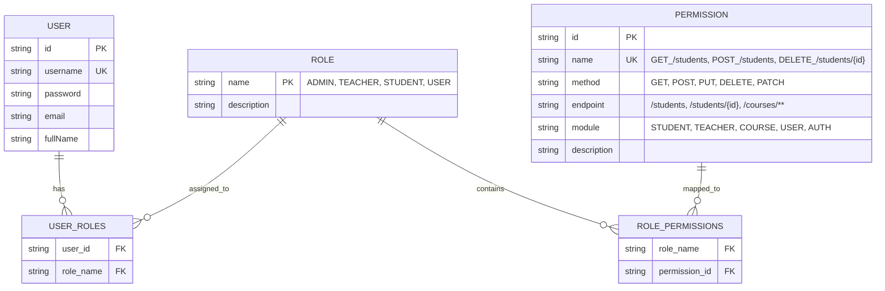
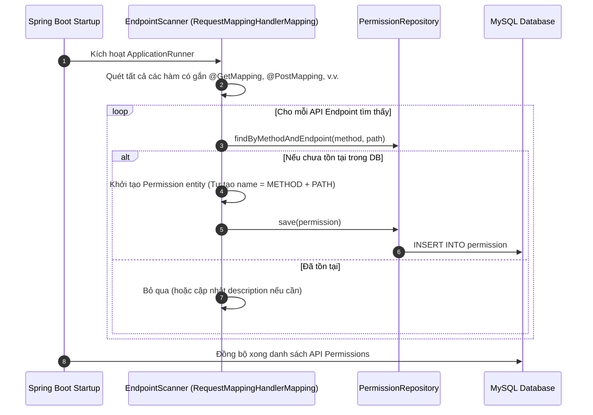
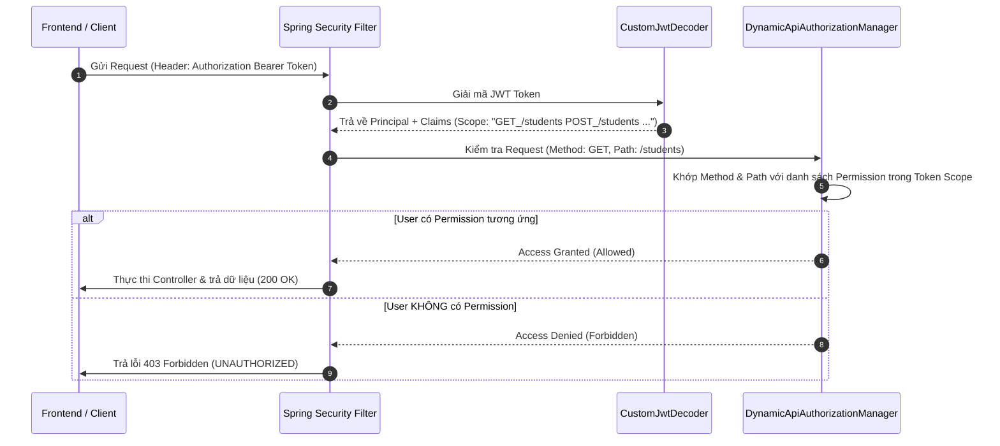

# Tài Liệu Thiết Kế Kiến Trúc Phân Quyền Theo API Endpoint (API-Based PBAC Design)

> **Dự án**: `university-management` (Backend Spring Boot)  
> **Ngày khởi tạo**: 2026-08-06  
> **Trạng thái**: Bản thảo kế hoạch (Draft Plan for User Approval)

---

## 1. Mục Tiêu Thiết Kế (Objectives)

1. **Phân quyền Động theo API Endpoint**: Mỗi API Endpoint (kết hợp `HTTP Method` + `URL Path`) tương ứng với một `Permission` cụ thể trong Database.
2. **Khởi tạo Tự động (Endpoint Auto-Registration)**: Khi nhà phát triển thêm mới bất kỳ `@RestController` / API Endpoint nào, ứng dụng khi khởi chạy sẽ **tự động quét (scan) và khởi tạo Permission mới** vào bảng `permission` nếu chưa tồn tại.
3. **Cấu trúc Bảng Linh Hoạt (Database Schema)**:
   - **`permission`**: Lưu thông tin từng API (`method`, `endpoint`, `name`, `description`, `module`).
   - **`role`**: Lưu vai trò người dùng (`ADMIN`, `TEACHER`, `STUDENT`, `USER`, ...).
   - **`role_permissions`**: Bảng trung gian ánh xạ 1 Role có nhiều Permission.
   - **`user_roles`**: Bảng trung gian ánh xạ 1 User có nhiều Role.
4. **Kiểm Tra Quyền Linh Hoạt**: Kiểm tra quyền truy cập API của người dùng thông qua Token JWT (chứa tập hợp tất cả permissions thuộc các role mà user sở hữu).

---

## 2. Thiết Kế Cơ Sở Dữ Liệu (Database Entity Schemas)

### 2.1. Chi Tiết Bảng `permission`
| Trọng số | Tên Trường | Kiểu Dữ Liệu | Diễn Giải | Ví Dụ |
| :--- | :--- | :--- | :--- | :--- |
| **PK** | `id` | `VARCHAR(36)` | Mã định danh UUID | `a1b2c3d4-...` |
| **UK** | `name` | `VARCHAR(100)` | Mã Permission duy nhất | `POST_/students` |
| | `method` | `VARCHAR(10)` | Phương thức HTTP | `POST`, `GET`, `PUT`, `DELETE` |
| | `endpoint` | `VARCHAR(255)` | Đường dẫn API Pattern | `/students`, `/students/{id}` |
| | `module` | `VARCHAR(50)` | Phân nhóm nghiệp vụ | `STUDENT`, `TEACHER`, `COURSE` |
| | `description` | `VARCHAR(255)` | Mô tả công dụng API | `Tạo mới hồ sơ sinh viên` |

---

## 3. Luồng Tự Động Quét API & Phân Quyền (Auto-Scan & Dynamic Enforcement)

### 3.1. Luồng Tự Động Quét API Endpoint Khởi Chạy (Startup Auto-Scan)

### 3.2. Luồng Kiểm Tra Quyền Truy Cập Khi User Gọi API (Authorization Enforcement Flow)

---

## 4. Kế Hoạch Triển Khai Chi Tiết (Implementation Plan)

### **Bước 1: Cập nhật Entity & Repository**
- Cập nhật `Permission.java` thêm trường `method`, `endpoint`, `module`.
- Tạo / Cập nhật `PermissionRepository.java` với phương thức `findByMethodAndEndpoint(String method, String endpoint)` và `findByName(String name)`.

### **Bước 2: Viết Trình Quét API Tự Động (`EndpointAutoScanner`)**
- Tạo `@Component` sử dụng `RequestMappingHandlerMapping` của Spring để quét toàn bộ Controller.
- Tự động lưu các Permission mới vào DB khi khởi chạy backend.
- Gán mặc định các API Permissions mới cho Role `ADMIN`.

### **Bước 3: Xây Dựng Trình Kiểm Tra Quyền Động (`DynamicApiAuthorizationManager`)**
- Tạo một `AuthorizationManager<RequestAuthorizationContext>` kiểm tra request hiện tại (HTTP Method + URI) đối so sánh với tập Permissions có trong Token của người dùng.
- Tích hợp vào `SecurityConfig.java`: `.anyRequest().access(dynamicApiAuthorizationManager)`.

### **Bước 4: Đồng Bộ Token Scope (`AuthenticationServiceImpl`)**
- Khi đăng nhập thành công, thu thập tất cả Permissions từ các Roles của User và đẩy vào claim `scope` của JWT (ví dụ: `GET_/students`, `POST_/students`, `DELETE_/students/{id}`).

### **Bước 5: Kiểm Thử Thực Tế (Empirical Verification)**
- Khởi chạy backend và kiểm tra log tự động quét API Permissions.
- Đăng nhập tài khoản `admin` và tài khoản `user` thường để kiểm tra phân quyền API chính xác (Cho phép vs Chặn 403).

---

## 5. Câu Hỏi Thảo Luận (Open Discussion)

1. Bạn có muốn đặt tên Permission theo định dạng `METHOD_PATH` (ví dụ: `POST_/students`) hay theo mã chức năng (ví dụ: `STUDENT_CREATE`)?  
   *(Khuyến nghị: Dùng `METHOD_PATH` hoặc tự động ánh xạ `GET_/students` $\rightarrow$ `STUDENT_READ` để hệ thống tự động nhận diện mượt mà nhất).*
2. Bạn có muốn phân quyền API cho Role `ADMIN` sở hữu **TẤT CẢ** các API Permission tự động không?
