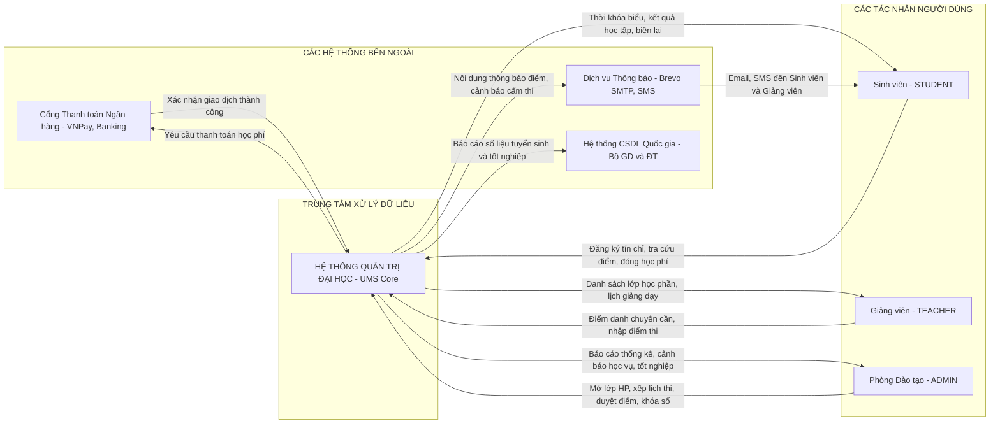
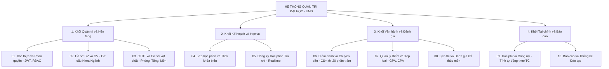
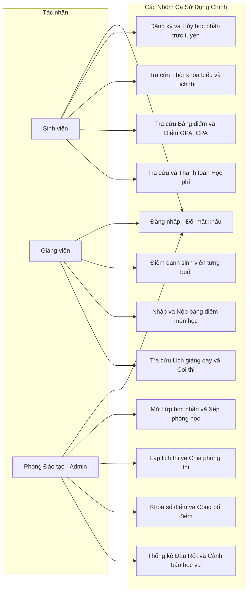
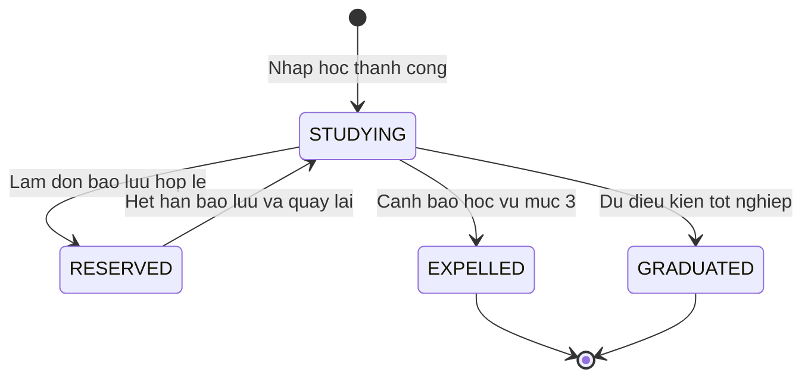
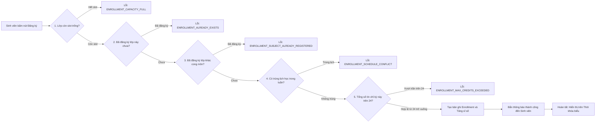
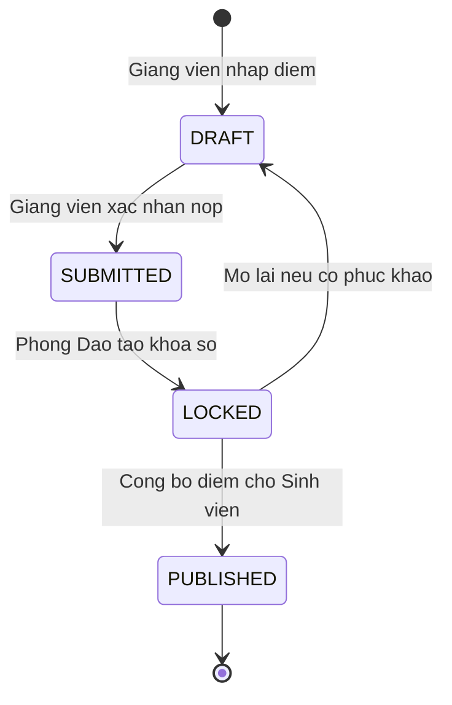
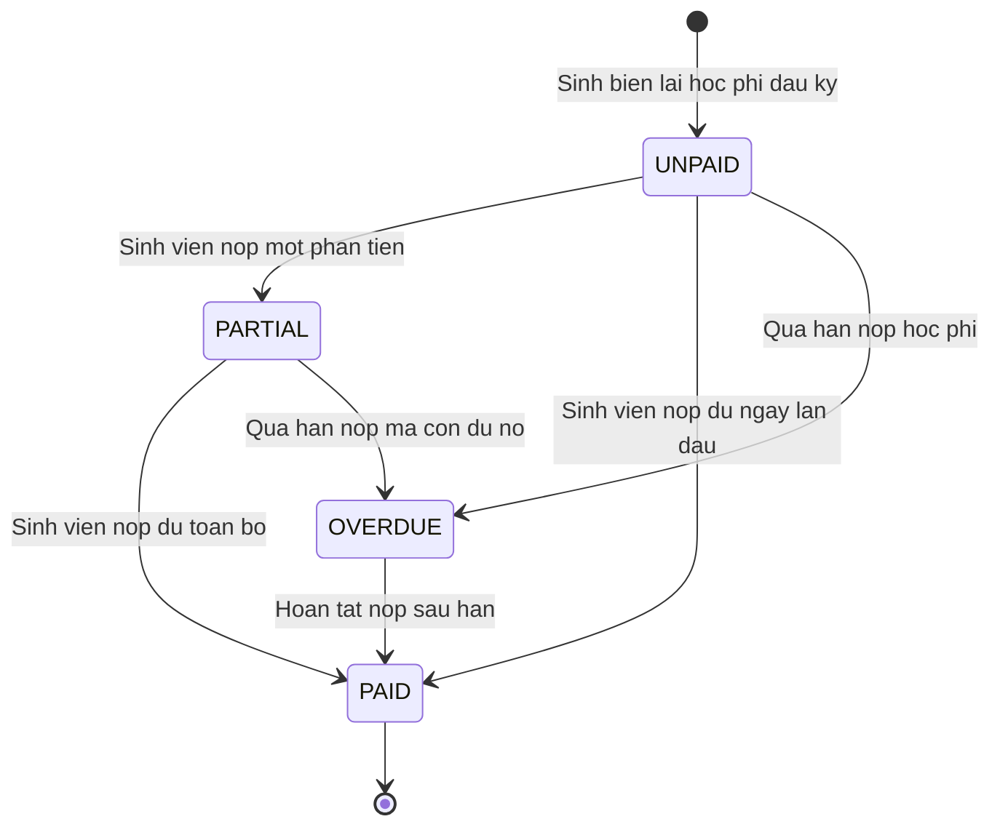

# TÀI LIỆU ĐẶC TẢ YÊU CẦU NGHIỆP VỤ TOÀN DIỆN (ENTERPRISE SRS)
# DỰ ÁN: HỆ THỐNG QUẢN TRỊ ĐẠI HỌC (UNIVERSITY MANAGEMENT SYSTEM)

---

## PHẦN I: THÔNG TIN QUẢN TRỊ DỰ ÁN

### 1.1. Bảng thông tin dự án & kiểm soát tài liệu

| Thuộc tính | Chi tiết |
| :--- | :--- |
| **Tên dự án** | Hệ thống Quản trị Đại học Toàn diện (University Management System - UMS) |
| **Mã tài liệu** | `SRS-UMS-MASTER-2026` |
| **Đơn vị phát triển** | Đội ngũ Phân tích Nghiệp vụ & Kỹ thuật Phần mềm (BA & Software Engineering Team) |
| **Đơn vị thụ hưởng** | Ban Giám hiệu, Phòng Đào tạo, Phòng Tài chính - Kế toán, Khối Khoa/Viện, Giảng viên & Toàn thể Sinh viên |
| **Nền tảng công nghệ** | Frontend: ReactJS (SPA) \| Backend: Spring Boot 3.x (Java) \| Database: PostgreSQL/MySQL \| Cache: Redis |
| **Trạng thái tài liệu** | `[CHÍNH THỨC - ĐÃ PHÊ DUYỆT BAN HÀNH]` |
| **Phiên bản hiện tại** | **v1.0 - Bản tổng thể hoàn thiện (Full Specification)** |
| **Ngày ban hành** | 22/09/2026 |

### 1.2. Nhật ký lịch sử phiên bản (Version History)

| Phiên bản | Ngày cập nhật | Người thực hiện | Nội dung thay đổi chi tiết | Lý do thay đổi |
| :---: | :---: | :---: | :--- | :--- |
| **v0.1** | 10/09/2026 | BA Team | Khảo sát quy trình đào tạo tín chỉ, lập danh mục thực thể ban đầu | Thu thập yêu cầu thô |
| **v0.5** | 18/09/2026 | BA Team | Dựng khung tài liệu 10 phân hệ, phác thảo API Controller | Hoàn thiện khung sườn dự án |
| **v1.0** | 22/09/2026 | Senior BA Lead | Bổ sung đầy đủ 100% User Stories, Tiêu chí nghiệm thu (AC), Từ điển dữ liệu toàn bộ thực thể, Sơ đồ trạng thái Lifecycle và Ma trận mã lỗi | Ban hành tài liệu chính thức cho Dev & QA |

---

## PHẦN II: TỔNG QUAN HỆ THỐNG & MA TRẬN PHÂN QUYỀN TOÀN TRƯỜNG

### 2.1. Tầm nhìn chiến lược & Bối cảnh bài toán
Hệ thống **UNIVERSITY MANAGEMENT** là nền tảng quản trị vòng đời học vụ khép kín (End-to-End Academic Lifecycle). Hệ thống giải quyết triệt để sự rời rạc dữ liệu giữa các bộ phận trong trường đại học, tự động hóa từ khâu Tuyển sinh ➔ Xếp lớp sinh hoạt ➔ Mở lớp học phần ➔ Đăng ký tín chỉ trực tuyến ➔ Điểm danh chuyên cần ➔ Chấm điểm & Xếp loại học lực ➔ Lập lịch thi ➔ Tính toán học phí và công nợ ➔ Xét tốt nghiệp.

### 2.2. Ma trận Phân quyền Tổng thể (Global RBAC Matrix)

| Phân hệ nghiệp vụ | Sinh viên (`STUDENT`) | Giảng viên (`TEACHER`) | Phòng Đào tạo (`ADMIN`) | Quản trị Kỹ thuật (`SUPER_ADMIN`) |
| :--- | :---: | :---: | :---: | :---: |
| **01. Xác thực & Tài khoản** | Đổi mật khẩu, xem hồ sơ cá nhân | Đổi mật khẩu, xem hồ sơ cá nhân | Quản lý tài khoản, cấp lại mật khẩu | Toàn quyền cấu hình Role & Permission |
| **02. Hồ sơ & Tổ chức** | Xem thông tin cá nhân | Xem danh sách lớp giảng dạy | Thêm/sửa/xóa SV, GV, Khoa, Ngành | Cấu hình tham số niên khóa toàn trường |
| **03. CTĐT & Cơ sở vật chất** | Tra cứu khung chương trình | Tra cứu môn giảng dạy | Quản lý môn học, tòa nhà, phòng học | Cấu hình điều kiện tiên quyết môn |
| **04. Lớp học phần & Lịch học** | Tra cứu thời khóa biểu cá nhân | Tra cứu lịch dạy cá nhân | Mở lớp HP, xếp lịch, phân công GV | Quản lý thuật toán chống trùng lịch |
| **05. Đăng ký Học phần** | Tự đăng ký, tự hủy môn hợp lệ | Xem danh sách lớp phụ trách | Đăng ký theo đợt, gán cả lớp SH | Cấu hình thời gian mở/đóng cổng đăng ký |
| **06. Điểm danh & Chuyên cần** | Xem số buổi nghỉ/có mặt | Điểm danh sinh viên từng buổi | Tra cứu vi phạm chuyên cần toàn trường | Cấu hình tỷ lệ nghỉ cấm thi (20%) |
| **07. Điểm số & Xếp loại** | Tra cứu bảng điểm, GPA/CPA | Nhập điểm, nộp bảng điểm | Khóa sổ điểm, công bố điểm toàn trường | Phê duyệt sửa điểm sau khi khóa sổ |
| **08. Lịch thi & Tổ chức thi** | Xem lịch thi, số báo danh | Xem lịch coi thi, chấm thi | Xếp phòng thi, chia ca thi, đánh SBD | Lọc danh sách sinh viên cấm thi |
| **09. Học phí & Công nợ** | Tra cứu học phí, công nợ | Không có quyền | Đối soát công nợ, duyệt miễn giảm | Cấu hình đơn giá định mức tín chỉ |
| **10. Báo cáo & Thống kê** | Không có quyền | Xuất bảng điểm môn | Thống kê đậu/rớt, cảnh báo học vụ | Xuất báo cáo tổng kết theo Bộ GD&ĐT |

---

## PHẦN III: HỆ THỐNG SƠ ĐỒ NGHIỆP VỤ TỔNG THỂ (BA ARCHITECTURE DIAGRAMS)

### 3.1. Sơ đồ Ngữ cảnh Hệ thống (System Context Diagram - DFD Level 0)
Sơ đồ mô tả dòng chảy thông tin hai chiều giữa Hệ thống Quản trị Đại học (UMS Core) và các tác nhân nội bộ cũng như các hệ thống tích hợp bên ngoài:

---

### 3.2. Sơ đồ Phân rã Chức năng Toàn hệ thống (Functional Decomposition / WBS)
Phân rã kiến trúc chức năng từ cấp độ nền tảng đến 10 phân hệ nghiệp vụ chính:

---

### 3.3. Sơ đồ Use Case Tổng thể Toàn trường (Global Use Case Diagram)
Ánh xạ vai trò người dùng đến các nhóm ca sử dụng cốt lõi:

---

### 3.4. Sơ đồ Quy trình Vòng đời Học vụ Khép kín (End-to-End Academic Lifecycle Flowchart)
Quy trình nghiệp vụ từ khi sinh viên nhập trường đến khi tốt nghiệp ra trường:

```mermaid
flowchart LR
    StartStep["Bắt đầu: Nhập học"] --> StepClassGroup["Xếp vào Lớp Sinh hoạt và Chuyên ngành"]
    StepClassGroup --> StepOpenSemester["Phòng Đào tạo mở đợt đăng ký và Lập TKB"]
    
    StepOpenSemester --> StepEnroll["Sinh viên Đăng ký Học phần Tín chỉ"]
    StepEnroll --> StepTuitionCalc["Hệ thống tự động tính Học phí theo số Tín chỉ"]
    
    StepEnroll --> StepStudy["Tiến hành Giảng dạy và Điểm danh từng buổi"]
    StepStudy --> CheckAttendance{"Tỷ lệ vắng mặt trên 20 phần trăm?"}
    
    CheckAttendance -- Có --> SetBan["Gắn cờ CẤM THI và Điểm thi bằng 0"]
    CheckAttendance -- Không --> ExamSchedule["Xếp vào Danh sách Phòng thi"]
    
    SetBan --> GradeCalc["Tính điểm Tổng kết môn"]
    ExamSchedule --> TakeExam["Tổ chức Thi và Chấm điểm"]
    TakeExam --> GradeCalc
    
    GradeCalc --> CheckPass{"Điểm tổng kết từ 4.0 trở lên?"}
    CheckPass -- Không đạt --> Retake["Ghi nhận Điểm F: Bắt buộc học lại"]
    CheckPass -- Đạt --> Accumulate["Tích lũy Tín chỉ và Tính GPA, CPA"]
    
    Retake --> CheckSemesterEnd{"Kết thúc Học kỳ?"}
    Accumulate --> CheckSemesterEnd
    
    CheckSemesterEnd --> TuitionCheck{"Đã hoàn thành Học phí?"}
    TuitionCheck -- Còn nợ --> BlockNext["Khóa quyền đăng ký học phần kỳ sau"]
    TuitionCheck -- Đã nộp đủ --> CheckGraduation{"Đủ điều kiện tốt nghiệp?"}
    
    BlockNext --> EndSemester["Kết thúc học kỳ"]
    CheckGraduation -- Chưa đủ tín chỉ --> NextSemester["Tiếp tục kỳ học tiếp theo"]
    NextSemester --> StepOpenSemester
    
    CheckGraduation -- Đủ điều kiện --> Graduate["XÉT TỐT NGHIỆP VÀ CẤP BẰNG CỬ NHÂN, KỸ SƯ"]
```

---

## CHƯƠNG 1: PHÂN HỆ XÁC THỰC, TÀI KHOẢN & BẢO MẬT (AUTH)

### 1.1. Mục tiêu & Đối tượng
Quản lý bảo mật phiên làm việc, cấp phát mã thông báo không trạng thái (Stateless JWT Token), kiểm soát quyền truy cập API theo vai trò và bảo vệ tài khoản trước các cuộc tấn công mạng.

### 1.2. Quy tắc nghiệp vụ cốt lõi (Business Rules)
* **BR-AUT-01 (Mã hóa mật khẩu)**: Mật khẩu người dùng bắt buộc tối thiểu 8 ký tự, phải có chữ hoa, chữ thường, số. Được băm một chiều bằng thuật toán `BCrypt` (độ dài muối 10-12). Tuyệt đối không lưu mật khẩu dạng bản rõ.
* **BR-AUT-02 (Cặp mã thông báo JWT & Thu hồi)**:
  * `Access Token`: Có hiệu lực trong **60 phút**, chứa thông tin định danh `userId`, `username` và danh sách quyền hạn `roles`.
  * `Refresh Token`: Có hiệu lực trong **7 ngày**, được lưu trữ trong Redis để cấp lại Access Token mới.
  * Khi người dùng bấm Đăng xuất (`Logout`), `jwtId` của Access Token lập tức được đưa vào danh sách đen (**Redis Blacklist**) với thời gian sống (TTL) bằng thời gian còn lại của Token để vô hiệu hóa tức thì.
* **BR-AUT-03 (Khóa tài khoản chống Brute-force)**: Nếu đăng nhập thất bại **5 lần liên tiếp** trên cùng một tài khoản trong vòng 10 phút, hệ thống tự động khóa tài khoản trong **15 phút** và gửi email cảnh báo bảo mật.

### 1.3. Danh sách User Stories & Tiêu chí nghiệm thu (AC)

| Mã số | Câu chuyện người dùng (User Story) | Tiêu chí nghiệm thu (Acceptance Criteria) |
| :---: | :--- | :--- |
| **US-AUT-01** | Là **Người dùng**, tôi muốn **đăng nhập bằng tài khoản và mật khẩu**, để **truy cập hệ thống**. | • **Giả sử (Given)**: Tài khoản `sv2026` đang hoạt động, mật khẩu là `Pass@123`. • **Khi (When)**: Nhập đúng thông tin và bấm Đăng nhập. • **Thì (Then)**: Hệ thống trả về HTTP 200 kèm `accessToken` và `refreshToken`, chuyển hướng về đúng giao diện vai trò. |
| **US-AUT-02** | Là **Người dùng**, tôi muốn **hệ thống tự gia hạn phiên làm việc khi Access Token hết hạn**, để **không bị gián đoạn thao tác**. | • **Giả sử (Given)**: `accessToken` đã hết hạn 60 phút nhưng `refreshToken` còn hạn. • **Khi (When)**: Ứng dụng client gửi yêu cầu `POST /auth/refresh`. • **Thì (Then)**: Hệ thống trả về `accessToken` mới hợp lệ mà không cần người dùng nhập lại mật khẩu. |
| **US-AUT-03** | Là **Quản trị viên**, tôi muốn **khóa tài khoản của người dùng khi có vi phạm**, để **ngăn chặn truy cập trái phép**. | • **Giả sử (Given)**: Tài khoản `user_102` đang hoạt động. • **Khi (When)**: Admin chuyển cờ `active = false` trên giao diện Quản lý người dùng. • **Thì (Then)**: Mọi yêu cầu gọi API từ tài khoản này bị từ chối với mã lỗi `HTTP 401 UNAUTHENTICATED`. |

### 1.4. Từ điển dữ liệu thực thể `User` (`users`)

| Tên thuộc tính | Tên cột DB | Kiểu dữ liệu | Bắt buộc | Mô tả & Ràng buộc |
| :--- | :--- | :--- | :---: | :--- |
| **ID người dùng** | `id` | `VARCHAR(36)` | Có | Khóa chính dạng UUID. |
| **Tên đăng nhập** | `username` | `VARCHAR(50)` | Có | Tên tài khoản duy nhất (`UNIQUE`), không dấu cách. |
| **Mật khẩu đã băm** | `password` | `VARCHAR(255)` | Có | Chuỗi băm BCrypt. |
| **Email liên hệ** | `email` | `VARCHAR(100)` | Có | Email chính thức, định dạng chuẩn RFC 5322. |
| **Số điện thoại** | `phone` | `VARCHAR(20)` | Không | Số điện thoại liên hệ cá nhân. |
| **Trạng thái hoạt động**| `active` | `BOOLEAN` | Có | `true`: Đang hoạt động; `false`: Bị khóa. |
| **Xóa mềm** | `deleted` | `BOOLEAN` | Có | `false`: Hợp lệ; `true`: Đã xóa. |

---

## CHƯƠNG 2: PHÂN HỆ HỒ SƠ SINH VIÊN, GIẢNG VIÊN & TỔ CHỨC (PROFILES)

### 2.1. Mục tiêu & Đối tượng
Quản lý cây cơ cấu tổ chức học vụ (Khoa ➔ Chuyên ngành ➔ Lớp sinh hoạt) và hồ sơ nhân sự đầy đủ của Giảng viên và Sinh viên kèm thông tin hành chính 3 cấp (Tỉnh/Thành ➔ Quận/Huyện ➔ Xã/Phường).

### 2.2. Sơ đồ Vòng đời Trạng thái Sinh viên (State Diagram)

### 2.3. Quy tắc nghiệp vụ cốt lõi
* **BR-PRO-01 (Công thức sinh Mã sinh viên)**: Mã sinh viên là duy nhất trong toàn hệ thống, sinh tự động theo quy tắc: `[Năm tuyển sinh 4 số][Mã chuyên ngành 2-3 chữ cái][Số thứ tự tăng dần 4 số]` (Ví dụ: `2026` + `IT` + `0042` ➔ `2026IT0042`).
* **BR-PRO-02 (Liên kết định danh Identity Mapping)**: Mỗi hồ sơ Sinh viên (`Student`) hoặc Giảng viên (`Teacher`) bắt buộc tham chiếu tới đúng một tài khoản trong bảng `users` qua trường `user_id`. Khi xóa mềm hồ sơ sinh viên, tài khoản người dùng tương ứng tự động bị vô hiệu hóa.
* **BR-PRO-03 (Quản lý Lớp sinh hoạt)**: Mỗi sinh viên chỉ thuộc về duy nhất một Lớp sinh hoạt (`ClassGroup`) tại một thời điểm. Giáo viên chủ nhiệm được phân công phụ trách lớp sinh hoạt để quản lý điểm rèn luyện và sinh hoạt lớp định kỳ.

### 2.4. Từ điển dữ liệu thực thể `Student` (`student`)

| Tên thuộc tính | Tên cột DB | Kiểu dữ liệu | Bắt buộc | Mô tả & Ràng buộc |
| :--- | :--- | :--- | :---: | :--- |
| **ID sinh viên** | `id` | `BIGINT` | Có | Khóa chính tự tăng (`PRIMARY KEY`). |
| **Mã sinh viên** | `student_code` | `VARCHAR(20)` | Có | Mã định danh duy nhất (`uk_student_code_deleted`). |
| **Họ và tên đệm** | `first_name` | `VARCHAR(50)` | Có | Họ và tên đệm của sinh viên. |
| **Tên chính** | `last_name` | `VARCHAR(50)` | Có | Tên gọi chính của sinh viên. |
| **Ngày sinh** | `dob` | `DATE` | Có | Ngày tháng năm sinh (Phải $\ge 17$ tuổi). |
| **Giới tính** | `gender` | `VARCHAR(10)` | Có | Enum: `MALE`, `FEMALE`, `OTHER`. |
| **ID Lớp sinh hoạt** | `class_group_id`| `BIGINT` | Có | Khóa ngoại tham chiếu bảng `class_group`. |
| **ID Chuyên ngành** | `major_id` | `BIGINT` | Có | Khóa ngoại tham chiếu bảng `major`. |
| **ID Tài khoản** | `user_id` | `VARCHAR(36)` | Có | Khóa ngoại tham chiếu bảng `users`. |
| **Trạng thái học vụ**| `status` | `VARCHAR(20)` | Có | Enum: `STUDYING`, `RESERVED`, `EXPELLED`, `GRADUATED`. |

---

## CHƯƠNG 3: CHƯƠNG TRÌNH ĐÀO TẠO & CƠ SỞ VẬT CHẤT (CURRICULUM)

### 3.1. Mục tiêu & Đối tượng
Quản lý cây danh mục học phần trong chương trình khung, quy định số tín chỉ lý thuyết/thực hành, điều kiện tiên quyết/song hành, và quản lý số hóa hạ tầng giảng đường (Tòa nhà ➔ Tầng ➔ Phòng học).

### 3.2. Quy tắc nghiệp vụ cốt lõi
* **BR-CUR-01 (Định mức Tín chỉ & Số tiết)**: Số tín chỉ của một môn học là một số nguyên dương từ 1 đến 10 (`credit >= 1 && credit <= 10`). Tổng số tiết chuẩn được tính theo công thức:
  $$\text{Tổng số tiết} = (\text{Số tín chỉ lý thuyết} \times 15) + (\text{Số tín chỉ thực hành} \times 30)$$
* **BR-CUR-02 (Ràng buộc Môn học Tiên quyết)**: Nếu môn B có môn tiên quyết là môn A (`prerequisite_subject_id`), sinh viên **bắt buộc phải có điểm tổng kết môn A đạt trạng thái qua môn (`status == PASSED`, điểm tổng kết $\ge 4.0$)** thì hệ thống mới cho phép đăng ký môn B.
* **BR-CUR-03 (Sức chứa Phòng học)**: Mỗi phòng học (`Room`) được khai báo sức chứa tối đa (`capacity`). Khi mở lớp học phần và gán phòng học, sĩ số tối đa của lớp học phần không được vượt quá sức chứa của phòng (`subjectClass.maxCapacity <= room.capacity`).

### 3.3. Từ điển dữ liệu thực thể `Subject` (`subject`)

| Tên thuộc tính | Tên cột DB | Kiểu dữ liệu | Bắt buộc | Mô tả & Ràng buộc |
| :--- | :--- | :--- | :---: | :--- |
| **ID môn học** | `id` | `BIGINT` | Có | Khóa chính tự tăng. |
| **Mã môn học** | `subject_code` | `VARCHAR(20)` | Có | Mã duy nhất (ví dụ: `IT001`, `MATH101`). |
| **Tên môn học** | `name` | `VARCHAR(150)`| Có | Tên học phần (ví dụ: *Lập trình Hướng đối tượng*). |
| **Số tín chỉ** | `credit` | `INT` | Có | Giá trị từ 1 đến 10. |
| **Tín chỉ lý thuyết** | `theory_credit` | `INT` | Có | Số tín chỉ phần lý thuyết trên lớp. |
| **Tín chỉ thực hành** | `practice_credit`| `INT` | Có | Số tín chỉ phần thực hành phòng Lab. |
| **ID Môn tiên quyết**| `prerequisite_id`| `BIGINT` | Không | Tham chiếu đệ quy tới chính bảng `subject`. |
| **ID Khoa phụ trách**| `department_id` | `BIGINT` | Có | Khóa ngoại tham chiếu bảng `department`. |

---

## CHƯƠNG 4: LỚP HỌC PHẦN & XẾP THỜI KHÓA BIỂU (SCHEDULE)

### 4.1. Mục tiêu & Đối tượng
Phòng Đào tạo mở các Lớp học phần cho từng học kỳ, phân bổ giảng viên đứng lớp và xếp lịch học trong tuần (Thứ, Tiết học bắt đầu, Tiết kết thúc, Phòng học).

### 4.2. Bảng quy chuẩn Khung giờ học theo Tiết

| Tiết học | Ca học | Giờ bắt đầu | Giờ kết thúc | Thời lượng |
| :---: | :---: | :---: | :---: | :---: |
| **Tiết 1** | Sáng | 07:00 | 07:45 | 45 phút |
| **Tiết 2** | Sáng | 07:50 | 08:35 | 45 phút |
| **Tiết 3** | Sáng | 08:45 | 09:30 | 45 phút |
| **Tiết 4** | Sáng | 09:40 | 10:25 | 45 phút |
| **Tiết 5** | Sáng | 10:30 | 11:15 | 45 phút |
| **Tiết 6** | Chiều | 12:30 | 13:15 | 45 phút |
| **Tiết 7** | Chiều | 13:20 | 14:05 | 45 phút |
| **Tiết 8** | Chiều | 14:15 | 15:00 | 45 phút |
| **Tiết 9** | Chiều | 15:10 | 15:55 | 45 phút |
| **Tiết 10** | Chiều | 16:00 | 16:45 | 45 phút |
| **Tiết 11** | Tối | 17:30 | 18:15 | 45 phút |
| **Tiết 12** | Tối | 18:20 | 19:05 | 45 phút |

### 4.3. Quy tắc nghiệp vụ cốt lõi
* **BR-SCH-01 (Thuật toán Chống trùng phòng học)**: Trong cùng học kỳ và năm học, một phòng học không thể xếp cho 2 lớp học phần khác nhau vào cùng Thứ trong tuần nếu có khoảng thời gian giao thoa:
  $$\text{Xung đột Phòng} \iff (\text{Cùng Thứ}) \land (\text{start}_1 < \text{end}_2) \land (\text{end}_1 > \text{start}_2)$$
* **BR-SCH-02 (Thuật toán Chống trùng lịch giảng viên)**: Một giảng viên không thể được xếp giảng dạy 2 lớp học phần khác nhau có ca học trùng thời gian trong cùng một ngày.
* **BR-SCH-03 (Thông báo đổi thời khóa biểu khẩn cấp)**: Khi Phòng Đào tạo thực hiện đổi phòng học hoặc đổi giờ dạy, hệ thống tự động kích hoạt dịch vụ thông báo (Push Notification) gửi tin nhắn khẩn cấp đến hòm thư nội bộ của toàn bộ sinh viên và giảng viên thuộc lớp học phần đó.

---

## CHƯƠNG 5: PHÂN HỆ ĐĂNG KÝ HỌC PHẦN TÍN CHỈ (ENROLLMENT)

> [!IMPORTANT]
> **Phân hệ trọng yếu nhất hệ thống với tải giao dịch lớn nhất.** Áp dụng 5 lớp bảo vệ kiểm tra logic và cơ chế khóa đồng thời chống sai lệch dữ liệu.

### 5.1. Sơ đồ quy trình đăng ký & Kiểm tra 5 lớp bảo vệ

### 5.2. Bảng 7 quy tắc nghiệp vụ vàng (Business Rules)

| Mã quy tắc | Tên quy tắc | Chi tiết logic xử lý | Mã lỗi hệ thống trả về |
| :--- | :--- | :--- | :--- |
| **BR-ENR-01** | **Kiểm tra Sĩ số tối đa** | Khi sinh viên bấm đăng ký, hệ thống đếm số bản ghi hợp lệ (`deleted = false` và khác `CANCELLED`). Nếu `currentCount >= maxCapacity`, lập tức từ chối yêu cầu. | `ENROLLMENT_CAPACITY_FULL` |
| **BR-ENR-02** | **Chống đăng ký trùng lớp** | Một sinh viên không thể có 2 bản ghi đăng ký còn hiệu lực trên cùng một lớp học phần (`studentId` + `subjectClassId`). | `ENROLLMENT_ALREADY_EXISTS` |
| **BR-ENR-03** | **Chống đăng ký trùng môn trong kỳ** | Một sinh viên chỉ được phép học 1 lớp học phần của 1 môn học trong 1 học kỳ. Muốn đổi sang lớp khác cùng môn thì bắt buộc phải hủy lớp cũ trước khi đăng ký lớp mới. | `ENROLLMENT_SUBJECT_ALREADY_REGISTERED` |
| **BR-ENR-04** | **Kiểm tra Xung đột Lịch học** | Kiểm tra lịch học môn mới với tất cả các môn đã đăng ký trong kỳ. Báo lỗi nếu trùng Thứ và giao thoa thời gian (`target.startTime < exist.endTime && target.endTime > exist.startTime`). | `ENROLLMENT_SCHEDULE_CONFLICT` |
| **BR-ENR-05** | **Giới hạn Trần Tín chỉ Học kỳ (24 Tín)** | Tổng số tín chỉ của tất cả các môn sinh viên đã đăng ký trong kỳ cộng với số tín chỉ của môn mới không được vượt quá **24 tín chỉ**. | `ENROLLMENT_MAX_CREDITS_EXCEEDED` |
| **BR-ENR-06** | **Điều kiện Hủy môn Tự phục vụ** | Sinh viên chỉ được phép tự hủy môn khi môn học chưa có điểm và chưa thi. Cụ thể chặn hủy nếu: 1. Bản ghi đã có điểm (`finalScore != null`). 2. Bảng điểm đã Khóa hoặc Công bố (`gradeStatus == LOCKED \|\| PUBLISHED`). 3. Môn học đã có kết quả `PASSED` hoặc `FAILED`. 4. Sinh viên bị Cấm thi (`isBannedFromExam == true`). | `ENROLLMENT_CANNOT_BE_CANCELLED` |
| **BR-ENR-07** | **Quyền Cưỡng chế của Quản trị viên** | Tài khoản có vai trò `ROLE_ADMIN` được quyền bỏ qua `BR-ENR-06` để hủy hoặc gán bổ sung sinh viên vào lớp học phần theo chỉ đạo của Nhà trường. | Không áp dụng (Bỏ qua kiểm tra) |

### 5.3. Xử lý Tranh chấp Dữ liệu đồng thời (Concurrency & Race Condition)
Khi lớp học phần chỉ còn **1 slot cuối cùng** nhưng có nhiều sinh viên cùng bấm Đăng ký tại cùng 1 phần nghìn giây:
* Áp dụng khóa bi quan (**Pessimistic Write Lock**) hoặc khóa phân tán (**Redis Distributed Lock**) trên bản ghi lớp học phần.
* Yêu cầu nào giành được khóa trước sẽ được cấp slot và cập nhật sĩ số; các yêu cầu còn lại nhận thông báo `ENROLLMENT_CAPACITY_FULL` ngay lập tức mà không bao giờ gây hiện tượng vượt quá sĩ số tối đa.

### 5.4. Từ điển dữ liệu thực thể `Enrollment` (`enrollment`)

| Tên thuộc tính | Tên cột DB | Kiểu dữ liệu | Bắt buộc | Mô tả & Ràng buộc |
| :--- | :--- | :--- | :---: | :--- |
| **ID đăng ký** | `id` | `BIGINT` | Có | Khóa chính tự tăng (`PRIMARY KEY`). |
| **Mã đăng ký** | `enrollment_code`| `VARCHAR(50)` | Có | Mã định danh duy nhất (ví dụ: `ENR_1774328810291`). |
| **ID Sinh viên** | `student_id` | `BIGINT` | Có | Khóa ngoại tham chiếu bảng `student`. |
| **ID Lớp học phần** | `subject_class_id`| `BIGINT` | Có | Khóa ngoại tham chiếu bảng `subject_class`. |
| **Trạng thái đăng ký**| `status` | `VARCHAR(20)` | Có | Enum: `REGISTERED`, `ENROLLED`, `CANCELLED`, `PASSED`, `FAILED`. |
| **Trạng thái bảng điểm**| `grade_status` | `VARCHAR(20)` | Có | Enum: `DRAFT`, `SUBMITTED`, `LOCKED`, `PUBLISHED`. |
| **Điểm chuyên cần** | `attendance_score`| `DOUBLE` | Không | Điểm chuyên cần (hệ 10, từ 0.0 đến 10.0). |
| **Điểm giữa kỳ** | `midterm_score` | `DOUBLE` | Không | Điểm giữa kỳ (hệ 10, từ 0.0 đến 10.0). |
| **Điểm cuối kỳ** | `final_score` | `DOUBLE` | Không | Điểm thi cuối kỳ (hệ 10, từ 0.0 đến 10.0). |
| **Điểm tổng kết** | `total_score` | `DOUBLE` | Không | Điểm tổng kết môn (hệ 10, làm tròn 1 chữ số thập phân). |
| **Điểm chữ** | `letter_grade` | `VARCHAR(10)` | Không | Quy đổi: `A`, `B+`, `B`, `C+`, `C`, `D+`, `D`, `F`. |
| **Điểm hệ 4** | `grade_point_4` | `DOUBLE` | Không | Quy đổi sang thang 4: từ 0.0 đến 4.0. |
| **Có đơn phúc khảo** | `is_appealed` | `BOOLEAN` | Có | `true`: Đang có đơn khiếu nại/phúc khảo điểm. |
| **Bị cấm thi** | `is_banned_from_exam`| `BOOLEAN` | Có | `true`: Nghỉ quá 20% số tiết, bị cấm thi. |
| **Tỷ lệ vắng mặt** | `absence_rate` | `DOUBLE` | Có | Tỷ lệ phần trăm vắng mặt trong kỳ. |

---

## CHƯƠNG 6: PHÂN HỆ ĐIỂM DANH & THEO DÕI CHUYÊN CẦN (ATTENDANCE)

### 6.1. Mục tiêu & Đối tượng
Giảng viên thực hiện điểm danh sinh viên trong từng buổi học theo thời khóa biểu thực tế, hệ thống tự động tổng hợp tỷ lệ chuyên cần và đưa ra quyết định cấm thi tự động.

### 6.2. Quy tắc nghiệp vụ cốt lõi
* **BR-ATT-01 (Bốn trạng thái điểm danh)**: Mỗi buổi điểm danh, sinh viên nhận một trong 4 trạng thái:
  * `PRESENT` (Có mặt): Tính 100% hiện diện.
  * `LATE` (Đi muộn): Đi muộn quá 15 phút, tính tương đương 0.5 buổi vắng.
  * `EXCUSED_ABSENCE` (Vắng có phép): Có minh chứng y tế/giấy phép được duyệt, không tính điểm phạt rèn luyện nhưng vẫn tính vào tổng số tiết vắng mặt.
  * `UNEXCUSED_ABSENCE` (Vắng không phép): Tính 1 buổi vắng, trừ điểm chuyên cần.
* **BR-ATT-02 (Quy tắc Cấm thi do Vắng quá 20% số tiết)**:
  * Tỷ lệ vắng mặt được tính bằng công thức:
    $$\text{Tỷ lệ vắng} = \frac{\text{Số tiết vắng không phép} + (0.5 \times \text{Số tiết đi muộn})}{\text{Tổng số tiết của môn học}} \times 100\%$$
  * Nếu **Tỷ lệ vắng > 20.0%**, hệ thống tự động:
    1. Cập nhật trường `is_banned_from_exam = true` trên bản ghi `Enrollment`.
    2. Tự động gán điểm thi kết thúc môn `finalScore = 0.0` và trạng thái môn = `FAILED`.
    3. Tự động loại tên sinh viên khỏi danh sách phòng thi ở Chương 8.

### 6.3. User Story & Tiêu chí nghiệm thu (AC)
* **US-ATT-01**: Là **Giảng viên**, tôi muốn **điểm danh cả lớp theo danh sách hiển thị trên màn hình**, để **ghi nhận sự có mặt của sinh viên trong buổi học**.
  * **Giả sử (Given)**: Buổi học số 3 của lớp `CS101-01` đang diễn ra, có 40 sinh viên.
  * **Khi (When)**: Giảng viên tích chọn trạng thái cho từng sinh viên và bấm "Lưu điểm danh".
  * **Thì (Then)**: Hệ thống ghi nhận 40 bản ghi vào bảng `attendance_record`, cập nhật lại tỷ lệ vắng mặt của từng sinh viên ngay lập tức.
* **US-ATT-02**: Là **Sinh viên**, tôi muốn **nhận thông báo cảnh báo khi số buổi vắng gần đạt ngưỡng 20%**, để **tôi chủ động đi học đầy đủ và không bị cấm thi**.
  * **Giả sử (Given)**: Môn học có 15 buổi học, ngưỡng cấm thi là vắng quá 3 buổi. Sinh viên đã vắng buổi thứ 2 (đạt 13.3%).
  * **Khi (When)**: Giảng viên lưu điểm danh buổi vắng thứ 2 của sinh viên.
  * **Thì (Then)**: Hệ thống tự động gửi thông báo Cảnh báo chuyên cần: *"Bạn đã vắng 2 buổi môn [Tên môn]. Nếu vắng thêm 2 buổi nữa bạn sẽ bị cấm thi!"*

---

## CHƯƠNG 7: PHÂN HỆ QUẢN LÝ ĐIỂM SỐ & XẾP LOẠI HỌC LỰC (GRADES)

### 7.1. Cấu trúc điểm thành phần & Công thức tính tổng kết môn
Điểm đánh giá học phần được chấm theo thang điểm 10 với trọng số tiêu chuẩn:
$$\text{Điểm tổng kết (Hệ 10)} = (\text{Điểm Chuyên cần} \times 10\%) + (\text{Điểm Giữa kỳ} \times 30\%) + (\text{Điểm Cuối kỳ} \times 60\%)$$
*(Quy tắc làm tròn: Làm tròn số học đến **1 chữ số thập phân**, ví dụ: 8.45 ➔ 8.5).*

### 7.2. Bảng quy đổi Thang điểm Chữ & Thang điểm 4

| Điểm hệ 10 | Điểm chữ | Điểm hệ 4 | Đánh giá học vụ |
| :---: | :---: | :---: | :--- |
| **8.5 - 10.0** | **A** | **4.0** | Đạt - Giỏi / Xuất sắc |
| **8.0 - 8.4** | **B+** | **3.5** | Đạt - Khá giỏi |
| **7.0 - 7.9** | **B** | **3.0** | Đạt - Khá |
| **6.5 - 6.9** | **C+** | **2.5** | Đạt - Trung bình khá |
| **5.5 - 6.4** | **C** | **2.0** | Đạt - Trung bình |
| **5.0 - 5.4** | **D+** | **1.5** | Đạt - Trung bình yếu |
| **4.0 - 4.9** | **D** | **1.0** | Đạt - Yếu (Cần cải thiện) |
| **< 4.0** | **F** | **0.0** | **Không đạt (Trượt môn - Bắt buộc học lại)** |

### 7.3. Công thức tính GPA & CPA
* **Điểm trung bình học kỳ (GPA - Grade Point Average)**:
  $$\text{GPA} = \frac{\sum (\text{Điểm hệ 4 của môn}_i \times \text{Số tín chỉ}_i)}{\sum \text{Số tín chỉ trong kỳ}}$$
* **Điểm trung bình tích lũy toàn khóa (CPA - Cumulative Point Average)**: Tính trên toàn bộ các môn đã tích lũy từ đầu khóa học đến hiện tại (loại trừ các môn không tính tín chỉ tích lũy như GDTC, GDQP).
* **Xếp loại tốt nghiệp toàn khóa**:
  * **Xuất sắc**: CPA từ `3.60` đến `4.00`
  * **Giỏi**: CPA từ `3.20` đến `3.59`
  * **Khá**: CPA từ `2.50` đến `3.19`
  * **Trung bình**: CPA từ `2.00` đến `2.49`

### 7.4. Sơ đồ Vòng đời Khóa sổ điểm (Grade Workflow)

* **BR-GRD-01 (Bảo mật sổ điểm)**: Khi bảng điểm đã chuyển sang trạng thái `LOCKED` hoặc `PUBLISHED`, Giảng viên hoàn toàn bị tước quyền sửa đổi trực tiếp. Mọi thay đổi điểm số bắt buộc phải qua quy trình Phúc khảo điểm và do tài khoản có quyền `ADMIN` thực hiện kèm lý do thay đổi được ghi lại trong nhật ký kiểm toán (Audit Log).

---

## CHƯƠNG 8: PHÂN HỆ LỊCH THI & TỔ CHỨC THI KẾT THÚC MÔN (EXAM)

### 8.1. Quy trình Xếp lịch thi & Chia phòng thi
1. Phòng Đào tạo tạo đợt thi kết thúc môn cho học kỳ.
2. Hệ thống quét toàn bộ sinh viên đã ghi danh vào lớp học phần và **tự động loại bỏ sinh viên có `is_banned_from_exam == true`**.
3. Danh sách sinh viên đủ điều kiện được sắp xếp theo Thứ tự ABC và tự động đánh **Số báo danh (SBD)** dạng `[Mã ca thi]_[STT 3 số]`.
4. Phân bổ đều sinh viên vào các phòng thi (mỗi phòng tối đa 30-40 thí sinh, đảm bảo khoảng cách chỗ ngồi).
5. Phân công 02 Cán bộ coi thi độc lập cho mỗi phòng thi.

### 8.2. Quy tắc nghiệp vụ cốt lõi
* **BR-EXM-01 (Chống trùng ca thi của sinh viên)**: Một sinh viên không thể có 2 môn thi cùng ngày và cùng khung giờ ca thi.
* **BR-EXM-02 (Chống trùng cán bộ coi thi)**: Một giảng viên không thể được phân công coi thi ở 2 phòng thi khác nhau trong cùng một ca thi.

### 8.3. Từ điển dữ liệu thực thể `ExamSchedule` (`exam_schedule`)

| Tên thuộc tính | Tên cột DB | Kiểu dữ liệu | Bắt buộc | Mô tả & Ràng buộc |
| :--- | :--- | :--- | :---: | :--- |
| **ID ca thi** | `id` | `BIGINT` | Có | Khóa chính tự tăng. |
| **Mã ca thi** | `exam_code` | `VARCHAR(50)` | Có | Mã định danh duy nhất (ví dụ: `EXAM_CS101_01`). |
| **ID Lớp học phần** | `subject_class_id`| `BIGINT` | Có | Khóa ngoại tham chiếu bảng `subject_class`. |
| **ID Môn học** | `subject_id` | `BIGINT` | Có | Khóa ngoại tham chiếu bảng `subject`. |
| **Ngày thi** | `exam_date` | `DATE` | Có | Ngày tổ chức thi kết thúc môn. |
| **Giờ bắt đầu** | `start_time` | `TIME` | Có | Giờ phát đề và bắt đầu làm bài. |
| **Giờ kết thúc** | `end_time` | `TIME` | Có | Giờ thu bài thi. |
| **Phòng thi** | `room` | `VARCHAR(50)` | Có | Tên phòng thi (ví dụ: `A1-302`). |
| **Hình thức thi** | `exam_format` | `VARCHAR(50)` | Có | Tự luận, Trắc nghiệm máy tính, Vấn đáp, Đồ án. |
| **ID Giám thị 1** | `proctor_id` | `BIGINT` | Có | Cán bộ coi thi số 1 (tham chiếu bảng `teacher`). |

---

## CHƯƠNG 9: PHÂN HỆ QUẢN LÝ HỌC PHÍ & CÔNG NỢ (TUITION)

### 9.1. Cơ chế Tính học phí tự động từ Đăng ký Tín chỉ
Sau khi đợt Đăng ký học phần (Chương 5) chính thức đóng, hệ thống kích hoạt Job tự động quét toàn bộ bản ghi `Enrollment` ở trạng thái hợp lệ để sinh biên lai học phí:
$$\text{Tổng học phí kỳ} = \sum (\text{Số tín chỉ môn}_i \times \text{Đơn giá 1 tín chỉ của ngành}) - \text{Miễn giảm chính sách}$$

### 9.2. Sơ đồ Vòng đời Biên lai Học phí (Tuition Lifecycle)

### 9.3. Quy tắc nghiệp vụ cốt lõi
* **BR-TUI-01 (Khóa quyền đăng ký học phần kỳ mới)**: Sinh viên ở trạng thái `OVERDUE` (còn nợ học phí của các kỳ trước) sẽ bị hệ thống **tự động khóa cổng Đăng ký học phần ở học kỳ tiếp theo** cho đến khi Phòng Kế hoạch - Tài chính xác nhận hoàn thành công nợ.
* **BR-TUI-02 (Quy tắc hoàn trả học phí khi hủy lớp)**:
  * Sinh viên tự hủy môn học trong thời gian quy định: Được hoàn trả 100% số tiền tín chỉ môn đó vào số dư tài khoản học vụ để cấn trừ vào kỳ tiếp theo.
  * Lớp học phần bị hủy do không đủ sĩ số tối thiểu: Toàn bộ sinh viên trong lớp được hoàn trả 100% học phí tự động.

### 9.4. Từ điển dữ liệu thực thể `TuitionFee` (`tuition_fee`)

| Tên thuộc tính | Tên cột DB | Kiểu dữ liệu | Bắt buộc | Mô tả & Ràng buộc |
| :--- | :--- | :--- | :---: | :--- |
| **ID biên lai** | `id` | `BIGINT` | Có | Khóa chính tự tăng. |
| **ID Sinh viên** | `student_id` | `BIGINT` | Có | Khóa ngoại tham chiếu bảng `student`. |
| **Học kỳ** | `semester` | `VARCHAR(20)` | Có | `SEMESTER_1`, `SEMESTER_2`, `SUMMER`. |
| **Năm học** | `academic_year` | `VARCHAR(30)` | Có | Chuỗi năm học (ví dụ: `2026-2027`). |
| **Tổng số tín chỉ** | `total_credits` | `INT` | Có | Tổng tín chỉ các môn học đã đăng ký hợp lệ. |
| **Đơn giá 1 tín chỉ**| `price_per_credit`| `BIGINT` | Có | Mặc định: 450,000 VNĐ / tín chỉ. |
| **Tổng tiền phải nộp**| `total_amount` | `BIGINT` | Có | `totalCredits * pricePerCredit`. |
| **Số tiền miễn giảm** | `discount_amount`| `BIGINT` | Có | Miễn giảm theo chế độ chính sách. |
| **Số tiền đã nộp** | `paid_amount` | `BIGINT` | Có | Thực tế số tiền sinh viên đã thanh toán. |
| **Số tiền còn nợ** | `debt_amount` | `BIGINT` | Có | `totalAmount - discountAmount - paidAmount`. |
| **Trạng thái học phí**| `status` | `VARCHAR(20)` | Có | Enum: `UNPAID`, `PARTIAL`, `PAID`, `OVERDUE`. |
| **Hạn chót thanh toán**| `due_date` | `DATE` | Có | Hạn cuối sinh viên phải nộp học phí. |

---

## CHƯƠNG 10: PHÂN HỆ BÁO CÁO & THỐNG KÊ HỌC VỤ (REPORTS)

### 10.1. Mục tiêu & Đối tượng
Cung cấp các báo cáo tổng hợp phục vụ công tác thanh tra, kiểm định chất lượng giáo dục và ban hành các quyết định khen thưởng, kỷ luật, buộc thôi học.

### 10.2. Các loại báo cáo quản trị bắt buộc
1. **Báo cáo Phổ điểm Lớp học phần**: Biểu đồ hình cột thể hiện số lượng và tỷ lệ % sinh viên đạt từng mức điểm chữ (A, B+, B, C+, C, D+, D, F), điểm trung bình lớp và độ lệch chuẩn.
2. **Danh sách Cảnh báo học vụ (Buộc thôi học / Cảnh cáo)**:
   * **Cảnh báo mức 1**: Điểm GPA học kỳ $< 1.0$ (Năm 1) hoặc $< 1.2$ (Năm 2 trở đi).
   * **Cảnh báo mức 2**: Bị cảnh báo liên tiếp 2 học kỳ chính.
   * **Buộc thôi học**: Bị cảnh báo mức 3 hoặc nợ quá 24 tín chỉ chưa tích lũy.
3. **Báo cáo Xét tốt nghiệp**: Danh sách sinh viên đủ điều kiện nhận bằng cử nhân/kỹ sư (Tích lũy đủ số tín chỉ khung chương trình, CPA $\ge 2.0$, hoàn thành chứng chỉ Tiếng Anh B1/TOEIC và chứng chỉ Giáo dục thể chất, Giáo dục quốc phòng, không còn nợ học phí).

---

## PHẦN IV: PHỤ LỤC MA TRẬN MÃ LỖI NGHIỆP VỤ TOÀN HỆ THỐNG

| Mã lỗi (Error Code) | HTTP Status | Thông điệp hiển thị cho Người dùng | Nguyên nhân phát sinh & Hướng xử lý |
| :--- | :---: | :--- | :--- |
| `UNAUTHENTICATED` | 401 | Bạn chưa đăng nhập hoặc phiên làm việc đã hết hạn | Token thiếu, sai chữ ký JWT hoặc đã hết hạn 60 phút. |
| `UNAUTHORIZED` | 403 | Bạn không có quyền thực hiện thao tác này | Vai trò của tài khoản không đủ thẩm quyền truy cập API. |
| `STUDENT_NOT_FOUND` | 404 | Không tìm thấy thông tin sinh viên trong hệ thống | ID hoặc Mã sinh viên không tồn tại trong CSDL. |
| `SUBJECT_CLASS_NOT_FOUND` | 404 | Không tìm thấy lớp học phần tương ứng | Lớp học phần chưa mở hoặc đã bị đóng/xóa mềm. |
| `ENROLLMENT_CAPACITY_FULL` | 400 | Lớp học phần này đã đầy sĩ số | Sĩ số thực tế đạt giới hạn `maxCapacity`. |
| `ENROLLMENT_ALREADY_EXISTS` | 400 | Bạn đã đăng ký lớp học phần này rồi | Trùng cặp `studentId` và `subjectClassId`. |
| `ENROLLMENT_SUBJECT_ALREADY_REGISTERED` | 400 | Môn học này đã được đăng ký trong học kỳ | Sinh viên đã ghi danh vào 1 lớp khác của cùng môn học. |
| `ENROLLMENT_SCHEDULE_CONFLICT` | 400 | Trùng thời khóa biểu với môn học khác bạn đã chọn | Trùng Thứ trong tuần và giao thoa khoảng thời gian tiết học. |
| `ENROLLMENT_MAX_CREDITS_EXCEEDED` | 400 | Tổng số tín chỉ đăng ký trong kỳ vượt quá 24 tín | Tổng số tín chỉ kỳ này đã cộng dồn vượt quá 24 tín chỉ. |
| `ENROLLMENT_CANNOT_BE_CANCELLED` | 400 | Không thể hủy học phần đã có điểm hoặc đã khóa sổ | Môn đã có điểm thi, đã khóa sổ điểm hoặc bị cấm thi. |
| `GRADE_ALREADY_LOCKED` | 400 | Bảng điểm môn học đã khóa, không thể chỉnh sửa | Giảng viên sửa điểm sau khi phòng đào tạo đã khóa sổ. |
| `TUITION_OVERDUE_BLOCKED` | 400 | Bạn còn nợ học phí kỳ trước, không thể đăng ký môn | Sinh viên đang ở trạng thái học phí `OVERDUE`. |

---

> 🚀 **HƯỚNG DẪN IMPORT FILE LÊN LARK DOCS:**
> 1. Mở ứng dụng **Lark** trên máy tính hoặc truy cập trình duyệt web tại `larksuite.com`.
> 2. Chọn mục **Docs** (hoặc biểu tượng **Drive** ở thanh điều hướng bên trái).
> 3. Nhìn góc trên cùng bên phải, bấm vào nút **`+` (New / Mới)** ➔ Chọn **`Import` (Nhập tệp)**.
> 4. Chọn file: `D:\My Project\UNIVERSITY_MANAGEMENT\docs\ba\UNIVERSITY_MANAGEMENT.md`.
> 5. **Kết quả**: Lark Docs sẽ lập tức chuyển đổi file này thành một trang **Lark Doc Master duy nhất**. Toàn bộ 10 chương, ma trận phân quyền, sơ đồ Mermaid và bảng từ điển dữ liệu sẽ hiển thị chuẩn đẹp 100% với cột mục lục Outline điều hướng mượt mà bên trái!
